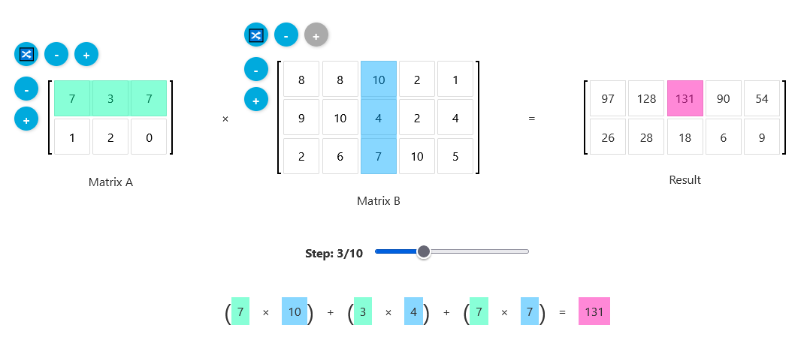

[Live Demo](https://static.laszlokorte.de/matrix-multiplication/)

# Matrix Multiplication

Below you can enter two matrices to see how they are multiplied. Use the round buttons to configure the matrix dimensions. The height of Matrix B must be equal to the width of Matrix A.

Inspired by http://matrixmultiplication.xyz/